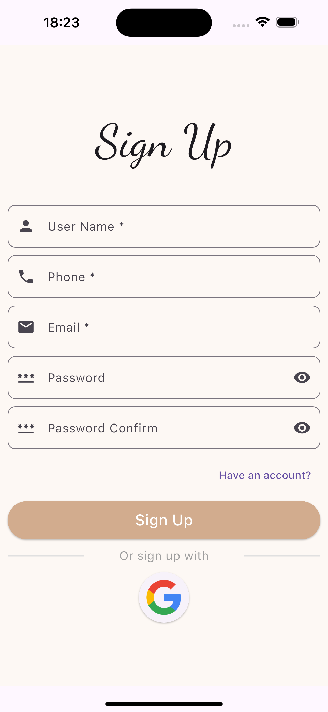
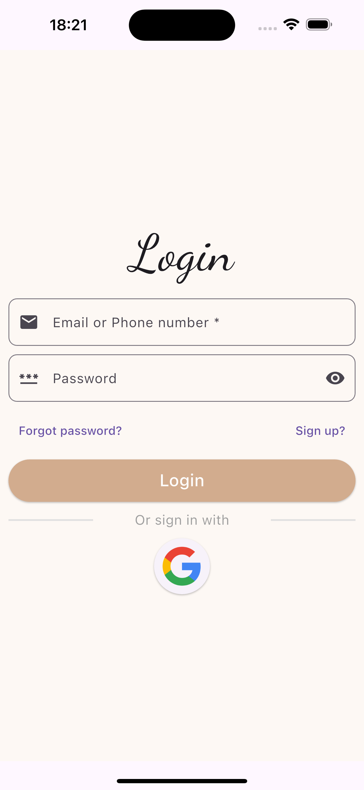
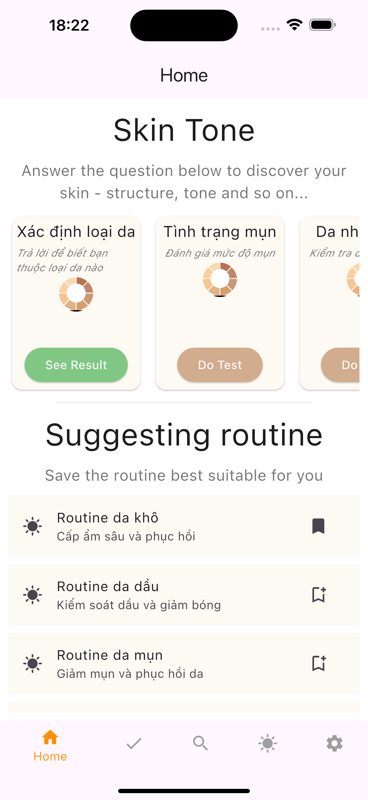
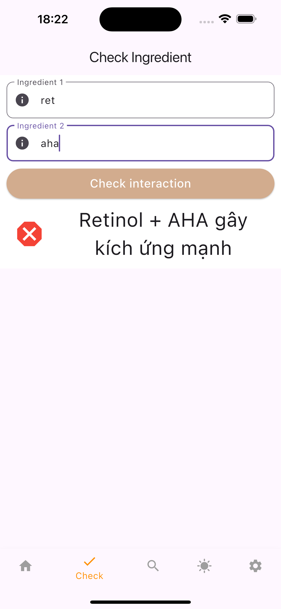
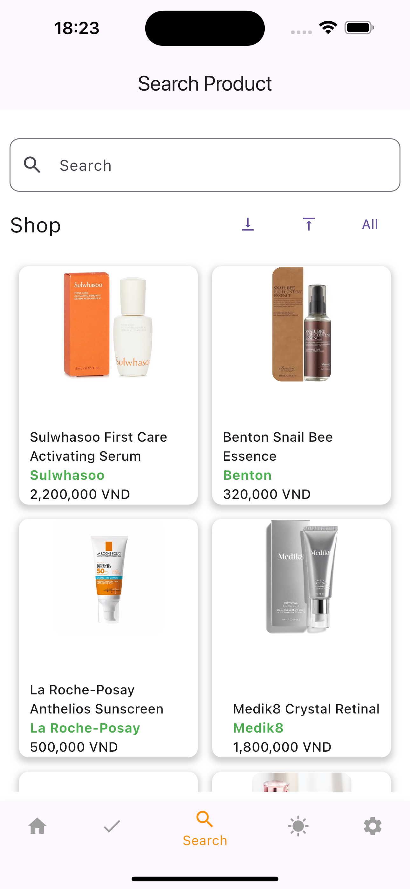
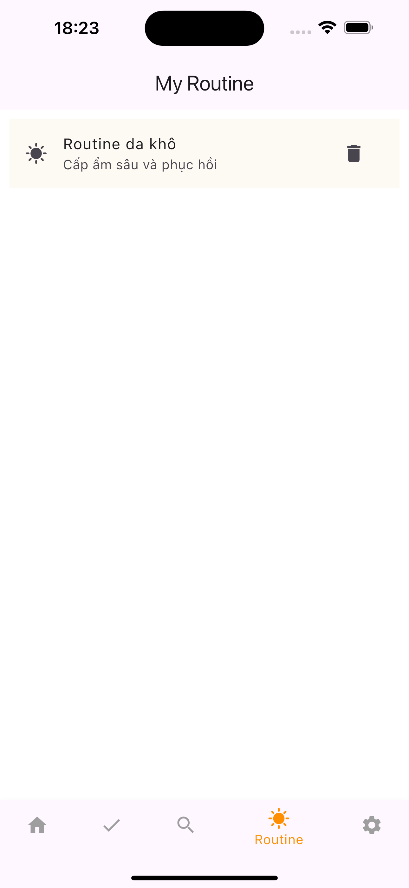
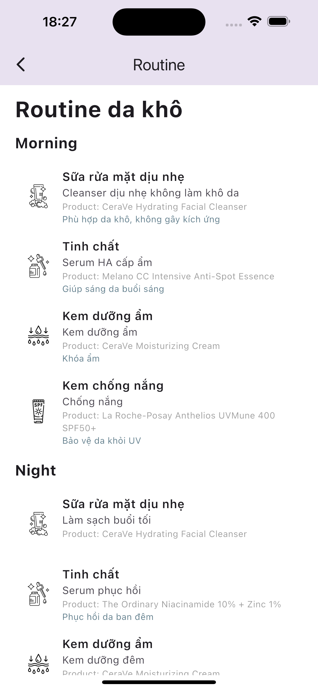
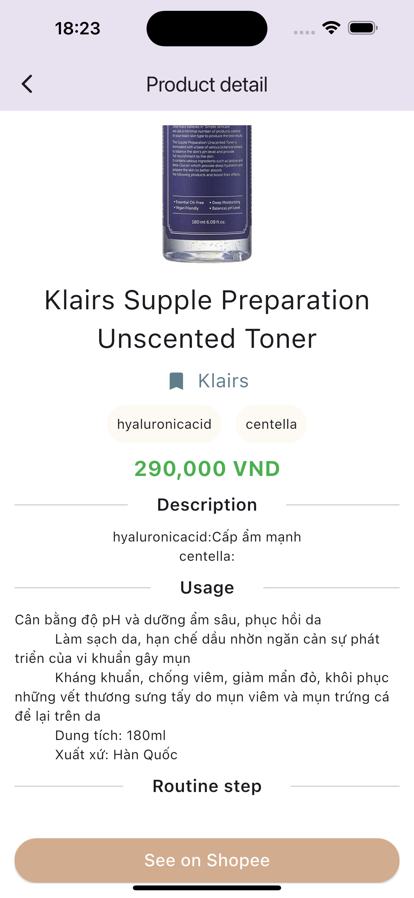
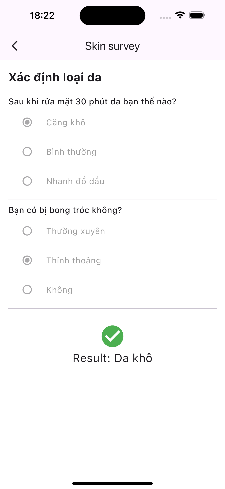
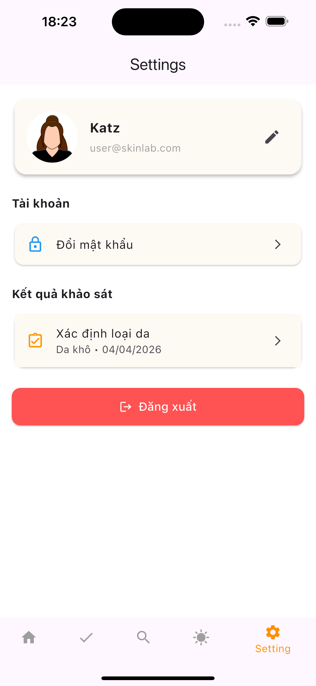

# 🌿 Skincare Routine App

A modern skincare application that helps users **build personalized routines**, **analyze skin conditions**, and **discover suitable products** based on their needs.

---

## 📱 Preview

<p align="center">
  
  
  
</p>

<p align="center">
  
  
  
</p>

<p align="center">
  
  
  
</p>

<p align="center">
  
</p>

---

## 🚀 Features

### 🧴 Skincare Routine

* Build personalized morning & night routines
* Step-by-step skincare guidance
* Optional product suggestions for each step

### 🔍 Product Discovery

* Search products by **name, brand, ingredients**
* Filter by price range
* Infinite scroll with smooth loading

### 🧪 Ingredient Analysis

* Check ingredient interactions (good / bad combinations)
* Prevent harmful skincare combinations

### 📊 Skin Survey

* Analyze user skin condition
* Suggest routines based on results
* Store survey history

### 👤 User Management

* Authentication (JWT)
* Profile management
* Save favorite routines

---

## 🛠️ Tech Stack

### Frontend

* Flutter
* Dart
* REST API integration

### Backend

* NestJS
* Prisma ORM
* PostgreSQL

### Others

* JWT Authentication
* Infinite Scroll Pagination
* Clean Architecture (Feature-first)

---

## 🧱 Project Structure

```
lib/
 ├── core/
 ├── features/
 │    ├── authentication/
 │    ├── product/
 │    ├── routine/
 │    ├── survey/
 │
 └── common/
```

---

## ⚙️ Installation

### 1️⃣ Clone project

```bash
git clone https://github.com/SFAri/skincare-app.git
cd skincare-app
```

### 2️⃣ Backend

```bash
cd BE
npm install
npx prisma migrate dev
npm run start:dev
```

### 3️⃣ Frontend

```bash
cd FE
flutter pub get
flutter run
```

---

## 🔗 API Example

```http
GET /api/products/search?q=retinol&page=1&limit=10
```

---

## 📌 Future Improvements

* 🔥 AI-based skincare recommendation
* 📸 Scan ingredient from product image
* ❤️ Community review system
* 🧠 Smart routine optimization

---

## 🙌 Author

👤 Dinh Ngoc Thuy Tien
📧 [thuytientien23@gmail.com](mailto:thuytientien23@gmail.com)
🔗 https://github.com/SFAri

---

## ⭐ Support

If you like this project, please ⭐ the repository!

---


